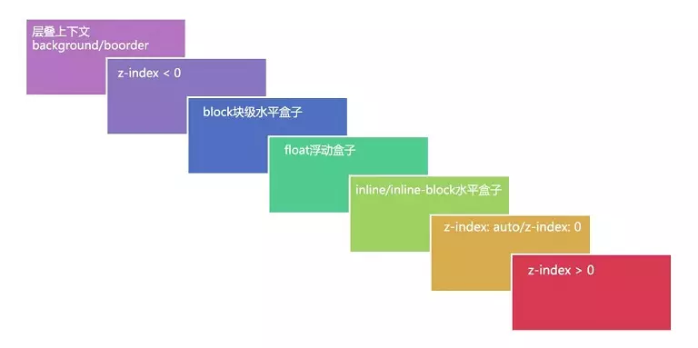

<!--
 * @Author: tangdaoyong
 * @Date: 2021-04-27 11:16:43
 * @LastEditors: tangdaoyong
 * @LastEditTime: 2021-04-27 11:37:48
 * @Description: 层叠顺序
-->
# 层叠顺序（Stacking Order）

## z-index

* `z-index`属性值并不是在任何元素上都有效果。它仅在定位元素（定义了`position`属性，且属性值为非`static`值的元素）上有效果。
* 判断元素在Z轴上的堆叠顺序，不仅仅是直接比较两个元素的`z-index`值的大小，这个堆叠顺序实际由元素的`层叠上下文`、`层叠等级`共同决定。

## 层叠上下文

层叠上下文(stacking context)，是HTML中一个三维的概念。在CSS2.1规范中，每个盒模型的位置是三维的，分别是平面画布上的X轴，Y轴以及表示层叠的Z轴。一般情况下，元素在页面上沿X轴Y轴平铺，我们察觉不到它们在Z轴上的层叠关系。而一旦元素发生堆叠，这时就能发现某个元素可能覆盖了另一个元素或者被另一个元素覆盖。

如果一个元素含有层叠上下文，(也就是说它是层叠上下文元素)，我们可以理解为这个元素在Z轴上就“高人一等”，最终表现就是它离屏幕观察者更近。

### 如何产生“层叠上下文”

前面说了那么多，知道了“层叠上下文”和“层叠等级”，其中还有一个最关键的问题：到底如何产生层叠上下文呢？如何让一个元素变成层叠上下文元素呢？

其实，层叠上下文也基本上是有一些特定的CSS属性创建的，一般有3种方法：

* HTML中的根元素<html></html>本身j就具有层叠上下文，称为“根层叠上下文”。
* 普通元素设置position属性为非static值并设置z-index属性为具体数值，产生层叠上下文。
* CSS3中的新属性也可以产生层叠上下文。

## 层叠等级

那么，层叠等级指的又是什么？层叠等级(stacking level，叫“层叠级别”/“层叠水平”也行)

* 在同一个层叠上下文中，它描述定义的是该层叠上下文中的层叠上下文元素在Z轴上的上下顺序。
* 在其他普通元素中，它描述定义的是这些普通元素在Z轴上的上下顺序。

再类比回“层叠上下文”和“层叠等级”，就得出一个结论：

1. 普通元素的层叠等级优先由其所在的层叠上下文决定。
2. 层叠等级的比较只有在当前层叠上下文元素中才有意义。不同层叠上下文中比较层叠等级是没有意义的。

## 层叠顺序

说完“层叠上下文”和“层叠等级”，我们再来说说“层叠顺序”。“层叠顺序”(stacking order)表示元素发生层叠时按照特定的顺序规则在Z轴上垂直显示。由此可见，前面所说的“层叠上下文”和“层叠等级”是一种概念，而这里的“层叠顺序”是一种规则。

在不考虑CSS3的情况下，当元素发生层叠时，层叠顺讯遵循上面途中的规则。 这里值得注意的是：

* 左上角"层叠上下文background/border"指的是层叠上下文元素的背景和边框。
* inline/inline-block元素的层叠顺序要高于block(块级)/float(浮动)元素。
* 单纯考虑层叠顺序，z-index: auto和z-index: 0在同一层级，但这两个属性值本身是有根本区别的。

> 为什么inline/inline-block元素的层叠顺序要高于block(块级)/float(浮动)元素？这个大家可以思考一下！ 其实很简单，像border/background属于装饰元素的属性，浮动和块级元素一般用来页面布局，而网页设计之初最重要的就是文字内容，所以在发生层叠时会优先显示文字内容，保证其不被覆盖。

## CSS3中的属性对层叠上下文的影响
CSS3中出现了很多新属性，其中一些属性对层叠上下文也产生了很大的影响。如下：

1. 父元素的display属性值为flex|inline-flex，子元素z-index属性值不为auto的时候，子元素为层叠上下文元素；
2. 元素的opacity属性值不是1；
3. 元素的transform属性值不是none；
4. 元素mix-blend-mode属性值不是normal`；
5. 元素的filter属性值不是none；
6. 元素的isolation属性值是isolate；
7. will-change指定的属性值为上面任意一个；
8. 元素的-webkit-overflow-scrolling属性值设置为touch

CSS3中，元素属性满足以上条件之一，就会产生层叠上下文。

